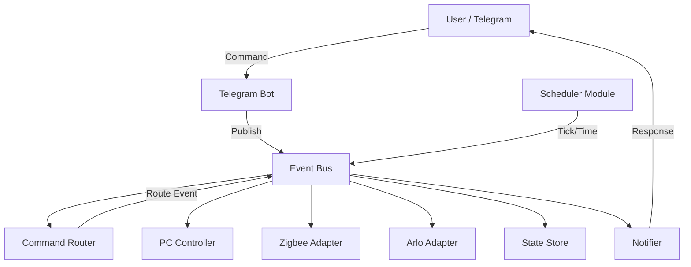

# RaspiHomeBot

A production-ready home automation system for Raspberry Pi, controlled via Telegram and a FastAPI API.

## Features

- **Event-Driven Architecture**: Uses an internal event bus for fully decoupled modules.
- **Independent Modules**: 
    - `CommandRouter`: Routes commands to specific events.
    - `ZigbeeAdapter`: Manage Zigbee devices (simulation).
    - `ArloAdapter`: Manage Arlo cameras (simulation).
    - `Scheduler`: Time-based events and background tasks.
    - `Notifier`: Centralized notification system.
    - `StateStore`: Consistent state across all modules.
    - `PCController`: WOL and SSH shutdown management.
    - `GateController`: Gate simulation logic.
- **Wake-on-LAN (WOL)**: Turn on your PC remotely.
- **SSH Shutdown**: Safely turn off your PC via SSH.
- **Telegram Bot**: Command-based interaction with RBAC.
- **REST API**: Minimal FastAPI endpoints.
- **Lightweight**: Optimized for Raspberry Pi (< 50MB RAM).
    - Uses `__slots__` for all core classes and modules to reduce object memory footprint.
    - Lazy loading of heavy libraries (e.g., `asyncssh`, `wakeonlan`).
    - Tuned Garbage Collection (GC) thresholds for more frequent cleanup.
    - Zero-dependency internal Event Bus for minimal overhead.
    - Consolidated background tasks into a single module, eliminating `APScheduler`.
    - Optimized Docker image with minimized environment and Python optimization flags.

## Project Structure

```text
app/
├── api/          # FastAPI routes
├── bot/          # Telegram bot handlers
├── core/         # Event Bus, Module interface, Config, Logging
├── database/     # Models and session
├── modules/      # Independent functional modules (Event-driven)
│   ├── command_router.py
│   ├── zigbee_adapter.py
│   ├── arlo_adapter.py
│   ├── scheduler.py
│   ├── notifier.py
│   ├── state_store.py
│   ├── pc_controller.py
│   └── gate_controller.py
├── services/     # Core logic (WOL, Gate, Permissions)
├── scheduler/    # Legacy background tasks (APScheduler)
└── utils/        # Network and SSH utilities
```

## Architecture Diagram



## Setup

1. Clone the repository to your Raspberry Pi.
2. Create a `.env` file based on `.env.example`:
   ```bash
   cp .env.example .env
   ```
3. Edit `.env` with your Telegram bot token, PC MAC/IP, and admin ID.
4. (Optional) Edit `config.yaml` based on `config.yaml.example` for custom intervals.
5. Place your SSH private key in the project root or adjust `SSH_KEY_PATH` in `.env`.
6. Run with Docker Compose:
   ```bash
   docker compose up -d
   ```

## Telegram Commands

- `/pc_on`: Send WOL packet and monitor startup.
- `/pc_off`: Shutdown PC via SSH.
- `/pc_status`: Check if PC is online.
- `/status`: Get a summary of the system state.
- `/gate_open`: Open the gate (available for guests).
- `/invite <user_id> <hours>h`: (Admin only) Grant temporary access to another user.

## CLI Simulator

You can simulate Telegram commands locally without actually running the bot:

```bash
# Check status as admin (defaults to ADMIN_TELEGRAM_ID from .env)
python cli.py /status

# Try to open gate as a specific user
python cli.py /gate_open --user-id 987654321

# Invite a user (Admin only)
python cli.py /invite 987654321 2h
```

## API Endpoints

- `GET /health`: System health check.
- `GET /status`: Detailed system status.
- `POST /pc/on`: Trigger WOL.
- `POST /pc/off`: Trigger SSH shutdown.

## License

MIT
