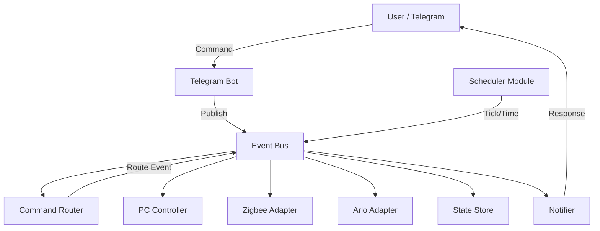

# RaspiHomeBot

A production-ready home automation system for Raspberry Pi, controlled via Telegram and a FastAPI API.

## Features

- **Event-Driven Architecture**: Uses an internal event bus for fully decoupled modules.
- **Independent Modules**: 
    - `CommandRouter`: Routes commands to specific events.
    - `ZigbeeAdapter`: Manage Zigbee devices (simulation).
    - `ArloAdapter`: Manage Arlo cameras (simulation).
    - `Scheduler`: Time-based events and background tasks.
    - `Notifier`: Centralized notification system.
    - `StateStore`: Consistent state across all modules.
    - `PCController`: WOL and SSH shutdown management.
    - `PermissionController`: RBAC and temporary access control.
    - `AceStepController`: Management of ACE-Step API and song generation process.
- **Wake-on-LAN (WOL)**: Turn on your PC remotely.
- **SSH Shutdown**: Safely turn off your PC via SSH.
- **Telegram Bot**: Command-based interaction with RBAC and interactive AI flows.
- **AI Integration**:
    - **Ollama**: Local AI for style and lyrics suggestions.
    - **ACE-Step 1.5**: Music generation API integration.
- **REST API**: Minimal FastAPI endpoints.
- **Lightweight**: Optimized for Raspberry Pi (< 50MB RAM).
    - Uses `__slots__` for all core classes and modules to reduce object memory footprint.
    - Lazy loading of heavy libraries (e.g., `asyncssh`, `wakeonlan`).
    - Tuned Garbage Collection (GC) thresholds for more frequent cleanup.
    - Zero-dependency internal Event Bus for minimal overhead.
    - Consolidated background tasks into a single module, eliminating `APScheduler`.
    - Optimized Docker image with minimized environment and Python optimization flags.

## Configuración de Módulos

El bot permite habilitar o deshabilitar módulos específicos según tus necesidades. Esto afectará tanto a los procesos internos como a los comandos disponibles en Telegram.

Configura la variable `ENABLED_MODULES` en tu archivo `.env`:
```env
ENABLED_MODULES=pc,gate,acestep,ollama,zigbee,arlo,scheduler
```

Módulos disponibles:
- `pc`: Comandos `/pc_on`, `/pc_off`, `/pc_status`.
- `gate`: Comandos `/gate_open`, `/invite`, `/invite_link_gate`, `/invite_gate`.
- `acestep`: Comandos `/acestep_start`, `/acestep_stop`, `/generate_song`.
- `ollama`: Comandos `/ollama_start`, `/ollama_stop` (asistencia en `/generate_song`).
- `zigbee`: Adaptador para dispositivos Zigbee.
- `arlo`: Adaptador para cámaras Arlo.
- `scheduler`: Tareas programadas en segundo plano.

## Project Structure

```text
app/
├── api/          # FastAPI routes
├── bot/          # Telegram bot handlers
├── core/         # Event Bus, Module interface, Config, Logging
├── database/     # Models and session
├── modules/      # Independent functional modules (Event-driven)
│   ├── command_router.py
│   ├── zigbee_adapter.py
│   ├── arlo_adapter.py
│   ├── scheduler.py
│   ├── notifier.py
│   ├── state_store.py
│   ├── pc_controller.py
│   └── gate_controller.py
├── prompts/      # LLM prompts for style/lyrics (ACE-Step compatible)
├── services/     # Core logic (WOL, Gate, Permissions)
├── scheduler/    # Legacy background tasks (APScheduler)
└── utils/        # Network and SSH utilities
```

## Architecture Diagram



## Setup

1. Clone the repository to your Raspberry Pi.
2. Create a `.env` file based on `.env.example`:
   ```bash
   cp .env.example .env
   ```
3. Edit `.env` with your Telegram bot token, PC MAC/IP, and admin ID.
4. (Optional) Edit `config.yaml` based on `config.yaml.example` for custom intervals.
5. Place your SSH private key in the project root or adjust `SSH_KEY_PATH` in `.env`.
6. Run with Docker Compose:
   ```bash
   docker compose up -d
   ```

## Telegram Commands

- `/pc_on`: Send WOL packet and monitor startup.
- `/pc_off`: Shutdown PC via SSH.
- `/pc_status`: Check if PC is online.
- `/status`: Get a summary of the system state.
- `/gate_open`: Abrir el portón (usuarios completos o invitados con acceso al portón por días).
- `/invite <user_id> <hours>h`: (Admin) Acceso temporal a otro usuario.
- `/invite_link <cantidad>`: (Admin) Enlace de invitación por canciones; te lo envía por privado.
- `/invite_link_gate <días>`: (Admin) Enlace de invitación al portón (acceso por N días); te lo envía por privado.
- `/invite_gate <user_id> <días>`: (Admin) Invitación al portón por ID y días.
- `/invite_songs <user_id> <cantidad> [horas]`: (Admin only) Invitar por ID a un usuario con un cupo limitado de canciones (solo puede usar `/generate_song`).
- `/grant_songs <user_id> <cantidad>`: (Admin only) Añadir más canciones al cupo de un invitado.
- `/estado_invitaciones`: (Admin only) Ver estado de invitaciones: canciones generadas, restantes y expiración.
- `/solicitar_canciones`: (Invitados con cupo) Solicitar más canciones al administrador.
- `/acestep_start`: Start the ACE-Step API on the host machine.
- `/acestep_stop`: Stop the ACE-Step API.
- `/save_song`: Guardar la última canción generada en el servidor (audio + JSON).
- `/ollama_start`: Start the Ollama server (requires `ollama` in PATH).
- `/ollama_stop`: Stop the Ollama server (if started by the bot).
- `/generate_song`: Interactive flow to create a song (Manual or AI-assisted).

## AI & Generation Services

El bot permite generar música utilizando **ACE-Step 1.5** y asistir en la creación de letras y estilos mediante **Ollama**. Ambas APIs pueden ser controladas directamente desde el bot.

### Requisitos
- **ACE-Step 1.5** instalado en el host. La ruta se configura en el archivo `.env`.
- **Ollama** instalado en el host y disponible en el PATH del sistema.

Los prompts para estilo y letra (compatibles con ACE-Step) están en `app/prompts/`. Cualquier integración con otro LLM debe usar esos mismos prompts para mantener el formato esperado por ACE-Step.

### Configuración (.env)
Asegúrate de configurar correctamente las rutas y puertos en tu archivo `.env`. 

**Nota para usuarios de Docker:**
Si el bot corre en un contenedor y ACE-Step/Ollama están en el host (Windows):
- Usa `PC_IP` (ej: `192.168.1.46`) o `host.docker.internal` en lugar de `127.0.0.1`.
- Configura correctamente `SSH_USER` y `SSH_KEY_PATH` para que el bot pueda acceder al host.
- Asegúrate de que el **Servidor OpenSSH** esté habilitado en Windows (Configuración > Aplicaciones > Características opcionales).
- El bot detectará automáticamente que está en Linux y usará SSH para ejecutar los comandos de Windows (`.bat`, `ollama serve`).

```env
# Configuración de Red para Docker -> Host Windows
PC_IP=192.168.1.46  # IP de tu computador en la red LAN
SSH_USER=tu_usuario_windows
SSH_KEY_PATH=/home/bot/.ssh/id_rsa

# ACE-Step
ACESTEP_PATH=C:\Users\KanoDoe\Desktop\ACE-Step-1.5
ACESTEP_HOST=192.168.1.46  # Misma IP que PC_IP o host.docker.internal
ACESTEP_PORT=8001

# Ollama
OLLAMA_BASE_URL=http://192.168.1.46:11434
OLLAMA_MODEL=llama3
```

### Recomendación para Producción: ACE-Step en Docker (Host Windows)

Si experimentas problemas de conectividad o firewall, la forma más robusta de correr ACE-Step en el PC remoto es usando Docker:
1. Instala **Docker Desktop** en Windows con soporte WSL2 y CUDA.
2. Crea un contenedor mapeando el puerto 8001: `-p 8001:8001`.
3. Esto asegura que la API escuche en todas las interfaces (`0.0.0.0`) y facilita la comunicación con la Raspberry Pi.

Si prefieres seguir usando el archivo `.bat` directamente, en el equipo remoto (Windows) edita `start_api_server_docker_remote.bat` del [repositorio oficial de ACE-Step 1.5](https://github.com/ace-step/ACE-Step-1.5): cambia `set HOST=127.0.0.1` por `set HOST=0.0.0.0` para que la API sea accesible desde el contenedor. Permite el puerto 8001 en el **Firewall de Windows** para conexiones entrantes.

### Flujo de Generación de Canción
1. Ejecuta `/generate_song`.
2. Selecciona **Asistido por IA**. Si Ollama no está activo, el bot intentará iniciarlo automáticamente; si no lo consigue, continuarás en modo manual o puedes usar `/ollama_start` y volver a intentar.
3. Describe el tema (ej: "Una canción de rock sobre un robot que quiere ser humano").
4. Ollama generará una propuesta de **Estilo** y **Letra** (formato compatible con ACE-Step).
5. Puedes **Aceptar**, **Refinar** (pedir cambios específicos) o **Regenerar**.
6. Una vez aceptado, se envía a ACE-Step. El bot te notificará cuando el audio esté listo y te lo enviará directamente.

## Invitaciones por cupo de canciones y administrador

Puedes invitar a otras personas con un **cupo limitado de canciones**: solo podrán usar el flujo de crear canción (`/generate_song` y `/solicitar_canciones`), no el resto de funciones del bot.

- **Canciones:** `/invite_songs <user_id> <cantidad>` o `/invite_link <cantidad>` (enlace por privado). Cuando agoten el cupo, `/solicitar_canciones` y tú usas `/grant_songs <user_id> <cantidad>`. **Portón:** `/invite_gate <user_id> <días>` o `/invite_link_gate <días>`; el invitado usa `/gate_open` y el bot reenvía la orden a `GATE_PROXY_URL`.
- **Avisos al admin:** La primera vez que un invitado use `/generate_song` recibirás un mensaje de “aceptación”. Cada vez que alguien genere una canción, recibirás una **copia en privado**: audio, JSON de la API y botón **“Guardar en servidor”** (solo tú puedes guardar audio + JSON; el usuario solo descarga el MP3).
- **Estado:** `/estado_invitaciones` muestra todas las invitaciones activas: quién, cuántas canciones ha generado, cuántas le quedan y fecha de expiración.

**Limitación de Telegram:** No es posible que cada usuario vea un menú de comandos distinto (“su propia instancia”); todos ven la misma lista de `/`. El bot ya restringe por permisos: los invitados solo pueden usar los comandos de canciones.

Documentación detallada: [docs/INVITACIONES_Y_ADMIN.md](docs/INVITACIONES_Y_ADMIN.md).

## Troubleshooting (Bot en contenedor + Windows remoto)

### El bot no arranca: "BOT_TOKEN was rejected" / 401 Unauthorized
- **Causa:** El token de Telegram en `.env` es inválido, está revocado o no existe.
- **Solución:** Obtén un token válido en [@BotFather](https://t.me/BotFather) (crea un bot o usa "API Token" en un bot existente). Ponlo en `.env` como `BOT_TOKEN=...`. Si el token llegó a verse en logs o en público, revócalo en BotFather y genera uno nuevo.

### La API de ACE-Step o Ollama “no se ve” desde el bot
- **Causa habitual:** El servicio está escuchando en `127.0.0.1` (solo localhost). Desde el contenedor no se puede conectar.
- **Solución:** En el PC Windows donde corre ACE-Step, edita `start_api_server_docker_remote.bat` y pon `set HOST=0.0.0.0`. Para Ollama, inicia el servicio con `OLLAMA_HOST=0.0.0.0` (o configúralo en el sistema). Abre el puerto correspondiente (8001 para ACE-Step, 11434 para Ollama) en el Firewall de Windows.
- **Importante:** Si la API ya está en ejecución y el bot no la ve, el bot **no** intentará matar el proceso; te indicará que configures `HOST=0.0.0.0` y el firewall.

### El bot intenta iniciar la API y no la ve / “ya estaba corriendo”
- Si ACE-Step u Ollama están corriendo en el host con `127.0.0.1`, el bot no puede conectarse por HTTP. Al intentar “iniciar”, el bot comprueba si el puerto está en uso; si lo está, **no** cierra el proceso y te pide que configures `HOST=0.0.0.0` y el firewall. Revisa la configuración en el equipo remoto y vuelve a probar.

### Errores SSH (comandos que no se ejecutan)
- **Requisitos:** OpenSSH habilitado en Windows, clave SSH (`SSH_KEY_PATH`), usuario (`SSH_USER`), puerto por defecto 22 (configurable con `SSH_PORT` en `.env` o `config.yaml`).
- Verifica que desde el contenedor puedas conectar por SSH al host (`ssh -i <clave> usuario@PC_IP`). Revisa los logs del bot: incluyen `exit_status`, `stderr` y el host:puerto para facilitar el diagnóstico.

### Ollama responde pero "model not found" (404)
- La conexión a Ollama funciona (puerto abierto) pero el **modelo** configurado en `OLLAMA_MODEL` (ej: `llama3`) no está instalado en el equipo donde corre Ollama. En ese equipo ejecuta `ollama pull llama3` (o el nombre que tengas en `.env`) o cambia `OLLAMA_MODEL` por un modelo que ya tengas instalado (ej: `llama3.2`, `mistral`). Para ver los modelos instalados: `ollama list`.

### Variables de red
- Usa `PC_IP` (IP LAN del PC), `ACESTEP_HOST` y `OLLAMA_BASE_URL` apuntando a esa IP (ej: `http://192.168.1.46:11434`), no a `127.0.0.1`, cuando el bot corre en Docker y los servicios en el host.

## CLI Simulator

You can simulate Telegram commands locally without actually running the bot:

```bash
# Check status as admin (defaults to ADMIN_TELEGRAM_ID from .env)
python cli.py /status

# Try to open gate as a specific user
python cli.py /gate_open --user-id 987654321

# Invite a user (Admin only)
python cli.py /invite 987654321 2h
```

## API Endpoints

- `GET /health`: System health check.
- `GET /status`: Detailed system status.
- `POST /pc/on`: Trigger WOL.
- `POST /pc/off`: Trigger SSH shutdown.

## License

MIT
