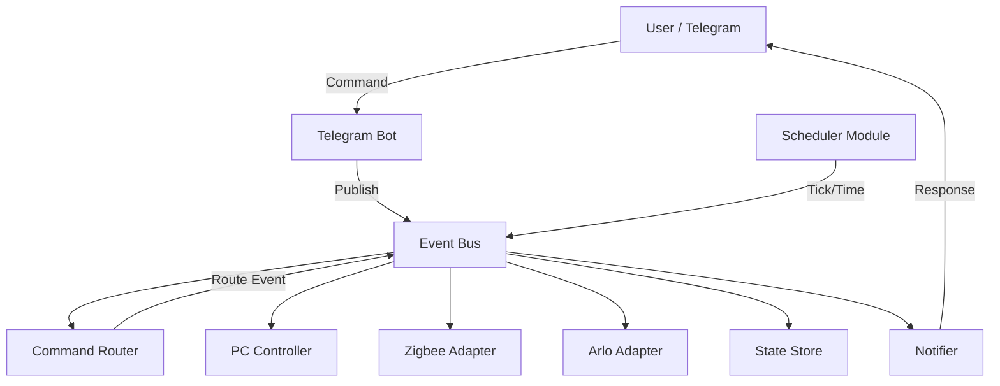

# RaspiHomeBot

A production-ready home automation system for Raspberry Pi, controlled via Telegram and a FastAPI API.

## Features

- **Event-Driven Architecture**: Uses an internal event bus for fully decoupled modules.
- **Independent Modules**: 
    - `CommandRouter`: Routes commands to specific events.
    - `ZigbeeAdapter`: Manage Zigbee devices (simulation).
    - `ArloAdapter`: Manage Arlo cameras (simulation).
    - `Scheduler`: Time-based events and background tasks.
    - `Notifier`: Centralized notification system.
    - `StateStore`: Consistent state across all modules.
    - `PCController`: WOL and SSH shutdown management.
    - `PermissionController`: RBAC and temporary access control.
    - `AceStepController`: Management of ACE-Step API and song generation process.
- **Wake-on-LAN (WOL)**: Turn on your PC remotely.
- **SSH Shutdown**: Safely turn off your PC via SSH.
- **Telegram Bot**: Command-based interaction with RBAC and interactive AI flows.
- **AI Integration**:
    - **Ollama**: Local AI for style and lyrics suggestions.
    - **ACE-Step 1.5**: Music generation API integration.
- **REST API**: Minimal FastAPI endpoints.
- **Lightweight**: Optimized for Raspberry Pi (< 50MB RAM).
    - Uses `__slots__` for all core classes and modules to reduce object memory footprint.
    - Lazy loading of heavy libraries (e.g., `asyncssh`, `wakeonlan`).
    - Tuned Garbage Collection (GC) thresholds for more frequent cleanup.
    - Zero-dependency internal Event Bus for minimal overhead.
    - Consolidated background tasks into a single module, eliminating `APScheduler`.
    - Optimized Docker image with minimized environment and Python optimization flags.

## Configuración de Módulos

El bot permite habilitar o deshabilitar módulos específicos según tus necesidades. Esto afectará tanto a los procesos internos como a los comandos disponibles en Telegram.

Configura la variable `ENABLED_MODULES` en tu archivo `.env`:
```env
ENABLED_MODULES=pc,gate,acestep,ollama,zigbee,arlo,scheduler
```

Módulos disponibles:
- `pc`: Comandos `/pc_on`, `/pc_off`, `/pc_status`.
- `gate`: Comandos `/gate_open`, `/invite`.
- `acestep`: Comandos `/acestep_start`, `/acestep_stop`, `/generate_song`.
- `ollama`: Comandos `/ollama_start`, `/ollama_stop` (asistencia en `/generate_song`).
- `zigbee`: Adaptador para dispositivos Zigbee.
- `arlo`: Adaptador para cámaras Arlo.
- `scheduler`: Tareas programadas en segundo plano.

## Project Structure

```text
app/
├── api/          # FastAPI routes
├── bot/          # Telegram bot handlers
├── core/         # Event Bus, Module interface, Config, Logging
├── database/     # Models and session
├── modules/      # Independent functional modules (Event-driven)
│   ├── command_router.py
│   ├── zigbee_adapter.py
│   ├── arlo_adapter.py
│   ├── scheduler.py
│   ├── notifier.py
│   ├── state_store.py
│   ├── pc_controller.py
│   └── gate_controller.py
├── services/     # Core logic (WOL, Gate, Permissions)
├── scheduler/    # Legacy background tasks (APScheduler)
└── utils/        # Network and SSH utilities
```

## Architecture Diagram



## Setup

1. Clone the repository to your Raspberry Pi.
2. Create a `.env` file based on `.env.example`:
   ```bash
   cp .env.example .env
   ```
3. Edit `.env` with your Telegram bot token, PC MAC/IP, and admin ID.
4. (Optional) Edit `config.yaml` based on `config.yaml.example` for custom intervals.
5. Place your SSH private key in the project root or adjust `SSH_KEY_PATH` in `.env`.
6. Run with Docker Compose:
   ```bash
   docker compose up -d
   ```

## Telegram Commands

- `/pc_on`: Send WOL packet and monitor startup.
- `/pc_off`: Shutdown PC via SSH.
- `/pc_status`: Check if PC is online.
- `/status`: Get a summary of the system state.
- `/gate_open`: Open the gate (available for guests).
- `/invite <user_id> <hours>h`: (Admin only) Grant temporary access to another user.
- `/acestep_start`: Start the ACE-Step API on the host machine.
- `/acestep_stop`: Stop the ACE-Step API.
- `/ollama_start`: Start the Ollama server (requires `ollama` in PATH).
- `/ollama_stop`: Stop the Ollama server (if started by the bot).
- `/generate_song`: Interactive flow to create a song (Manual or AI-assisted).

## AI & Generation Services

El bot permite generar música utilizando **ACE-Step 1.5** y asistir en la creación de letras y estilos mediante **Ollama**. Ambas APIs pueden ser controladas directamente desde el bot.

### Requisitos
- **ACE-Step 1.5** instalado en el host. La ruta se configura en el archivo `.env`.
- **Ollama** instalado en el host y disponible en el PATH del sistema.

### Configuración (.env)
Asegúrate de configurar correctamente las rutas y puertos en tu archivo `.env`. 

**Nota para usuarios de Docker en Windows/macOS:**
Si el bot corre en un contenedor y ACE-Step/Ollama están en el host, usa `host.docker.internal` en lugar de `127.0.0.1`.

```env
# ACE-Step
ACESTEP_PATH=C:\Users\TuUsuario\Desktop\ACE-Step-1.5
ACESTEP_HOST=192.168.1.46  # IP del PC con ACE-Step (o host.docker.internal)
ACESTEP_PORT=8001

# Ollama
OLLAMA_BASE_URL=http://192.168.1.46:11434  # IP del PC con Ollama
OLLAMA_MODEL=llama3
```

### Gestión de Servicios
Si los servicios no están corriendo por defecto, el bot intentará levantarlos:
- `/acestep_start`: Si el bot está en la misma máquina, usa `subprocess`. Si el host es remoto, usa **SSH** (requiere servidor SSH en el destino).
- `/ollama_start`: Similar a ACE-Step, intentará ejecutar `ollama serve` local o remotamente.

> **Importante**: Para el control remoto vía SSH, asegúrate de que `SSH_USER` y `SSH_KEY_PATH` en el `.env` correspondan al equipo donde están ACE-Step y Ollama.

### Flujo de Generación de Canción
1. Ejecuta `/generate_song`.
2. Selecciona **Asistido por IA**. Si Ollama no está activo, el bot te avisará y podrás usar el modo manual o intentar levantarlo con `/ollama_start`.
3. Describe el tema (ej: "Una canción de rock sobre un robot que quiere ser humano").
4. Ollama generará una propuesta de **Estilo** y **Letra**.
5. Puedes **Aceptar**, **Refinar** (pedir cambios específicos) o **Regenerar**.
6. Una vez aceptado, se envía a ACE-Step. El bot te notificará cuando el audio esté listo y te lo enviará directamente.

## CLI Simulator

You can simulate Telegram commands locally without actually running the bot:

```bash
# Check status as admin (defaults to ADMIN_TELEGRAM_ID from .env)
python cli.py /status

# Try to open gate as a specific user
python cli.py /gate_open --user-id 987654321

# Invite a user (Admin only)
python cli.py /invite 987654321 2h
```

## API Endpoints

- `GET /health`: System health check.
- `GET /status`: Detailed system status.
- `POST /pc/on`: Trigger WOL.
- `POST /pc/off`: Trigger SSH shutdown.

## License

MIT
